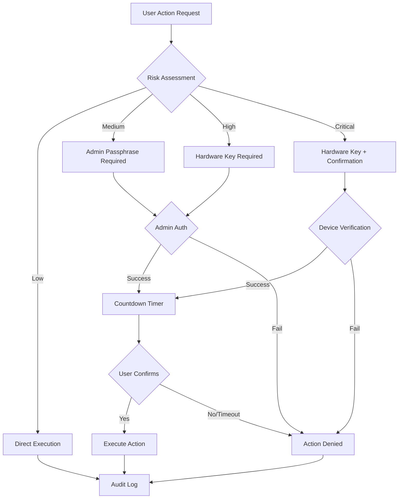

# Audit and Admin Documentation

## Overview

The Ephemeral Messenger includes a comprehensive audit and administrative control system designed to provide accountability, traceability, and secure governance for all security-sensitive operations. This system ensures that all administrative actions are properly authorized, logged, and verifiable.

## Administrative Control Framework

### Multi-Layered Security

#### 1. Authentication Layer
- **Hardware Key Authentication**: Primary admin access method
- **Admin Passphrase**: Backup authentication with Argon2id protection
- **Multi-Factor Options**: YubiKey touch, TOTP (configurable)

#### 2. Authorization Layer
- **Risk-Based Approvals**: Different approval requirements based on action risk
- **Administrative Policies**: Configurable approval workflows
- **Separation of Duties**: Admin actions separate from user operations

#### 3. Audit Layer
- **Cryptographic Integrity**: Ed25519 signatures on all audit entries
- **Immutable Logs**: Append-only audit trail with hash chaining
- **Distributed Storage**: Logs stored on hardware keys and local storage

## Admin Approval System

### Risk Classification

#### Low Risk (Score: 1-2)
- **Examples**: View settings, export configurations
- **Requirements**: User authentication only
- **Approval Time**: Immediate
- **Logging**: Basic audit entry

#### Medium Risk (Score: 3-4)
- **Examples**: Settings lock/unlock, retention mode changes
- **Requirements**: Admin passphrase OR hardware key
- **Approval Time**: 30-second countdown
- **Logging**: Detailed audit entry with justification

#### High Risk (Score: 5-6)
- **Examples**: Enable local-only access, panic mode configuration
- **Requirements**: Admin hardware key + confirmation phrase
- **Approval Time**: 60-second countdown
- **Logging**: Full audit entry with approval chain

#### Critical Risk (Score: 7+)
- **Examples**: Full drive wipe enablement, wipe USB creation
- **Requirements**: Admin hardware key + typed confirmation + device verification
- **Approval Time**: 120-second countdown
- **Logging**: Complete audit trail with multiple verification steps

### Approval Workflow



### Admin Authentication Methods

#### 1. Hardware Key Authentication
```rust
pub struct AdminHardwareAuth {
    device_id: String,
    key_path: String,
    challenge_response: Vec<u8>,
    timestamp: DateTime<Utc>,
}
```

**Process**:
1. Detect admin hardware key
2. Validate key identity and permissions
3. Generate cryptographic challenge
4. Verify key response
5. Create authenticated session

**Security Features**:
- Device-specific challenges
- Replay attack protection
- Automatic timeout
- Tamper detection

#### 2. Admin Passphrase Authentication
```rust
pub struct AdminPassphraseAuth {
    argon2_params: Argon2Params,
    salt: [u8; 32],
    password_hash: [u8; 32],
    last_used: DateTime<Utc>,
}
```

**Process**:
1. Prompt for admin passphrase
2. Derive key using Argon2id
3. Verify against stored hash
4. Create time-limited session
5. Log authentication attempt

**Security Features**:
- Strong key derivation (Argon2id)
- Rate limiting on failures
- Automatic lockout after attempts
- Secure memory handling

#### 3. Multi-Factor Authentication
```rust
pub enum SecondFactor {
    YubiKeyTouch {
        serial: String,
        challenge: [u8; 32],
        response: [u8; 32],
    },
    TOTP {
        code: String,
        window: u32,
        used_codes: Vec<String>,
    },
}
```

**YubiKey Touch**:
- Physical touch confirmation required
- Challenge-response protocol
- Serial number verification
- Replay protection

**TOTP (Time-based One-Time Password)**:
- RFC 6238 compliant
- 30-second time windows
- Drift tolerance (±1 window)
- Used code tracking

## Audit System Architecture

### Audit Entry Structure

```rust
pub struct AuditEntry {
    // Identity and Tracking
    pub id: String,                    // UUID for unique identification
    pub timestamp: DateTime<Utc>,      // Precise timestamp
    pub sequence_number: u64,          // Monotonic sequence

    // Action Details
    pub action: AdminAction,           // Specific action taken
    pub details: ActionDetails,        // Action-specific information
    pub risk_level: RiskLevel,        // Risk assessment

    // Authorization
    pub admin_identity: String,        // Admin who authorized
    pub approval_method: ApprovalMethod, // How approval was granted
    pub justification: String,         // Business justification

    // Integrity
    pub signature: Vec<u8>,           // Ed25519 signature
    pub previous_hash: Option<String>, // Hash of previous entry
    pub data_hash: String,            // Hash of entry data
}

pub struct ActionDetails {
    pub description: String,
    pub previous_value: Option<String>,
    pub new_value: Option<String>,
    pub affected_resources: Vec<String>,
    pub additional_context: HashMap<String, String>,
}
```

### Cryptographic Integrity

#### Digital Signatures
- **Algorithm**: Ed25519 (RFC 8032)
- **Key Size**: 256 bits
- **Performance**: Fast verification
- **Security**: Quantum-resistant candidate

**Signing Process**:
1. Serialize audit entry (excluding signature)
2. Generate canonical representation
3. Sign with admin's Ed25519 private key
4. Attach signature to entry
5. Verify signature before storage

#### Hash Chaining
```rust
fn calculate_entry_hash(entry: &AuditEntry) -> String {
    let mut hasher = Sha256::new();
    hasher.update(serde_json::to_vec(entry).unwrap());
    format!("{:x}", hasher.finalize())
}

fn link_entries(previous: &AuditEntry, current: &mut AuditEntry) {
    current.previous_hash = Some(calculate_entry_hash(previous));
}
```

**Chain Verification**:
- Each entry contains hash of previous entry
- Tamper detection through hash verification
- Complete chain validation on startup
- Merkle tree construction for efficiency

### Audit Storage

#### 1. Hardware Key Storage
```
Hardware Key:
├── audit_log.jsonl          # Append-only JSONL format
├── audit_index.json         # Index for fast lookup
├── signatures/              # Detached signatures
│   ├── entry_001.sig
│   └── entry_002.sig
└── metadata.json           # Storage metadata
```

**Features**:
- Tamper-evident storage
- Physical security
- Portable audit trail
- Offline verification

#### 2. Local Storage
```
Local Audit Directory:
├── audit_YYYY-MM.jsonl      # Monthly rotation
├── audit_index.db           # SQLite index
├── signatures/              # Ed25519 signatures
└── checksums.sha256         # File integrity
```

**Features**:
- High-performance queries
- Rotation and archival
- Backup integration
- Local analytics

#### 3. Distributed Copies
- **Network Storage**: Optional encrypted backups
- **Print Archives**: Physical audit records
- **Secure Enclaves**: HSM or secure processor storage

### Audit Events

#### Authentication Events
```json
{
  "action": "AdminAuthentication",
  "details": {
    "method": "HardwareKey",
    "device_id": "admin_key_001",
    "success": true,
    "session_id": "sess_abc123"
  },
  "risk_level": "Low"
}
```

#### Configuration Changes
```json
{
  "action": "EnableLocalOnlyAccess",
  "details": {
    "description": "Enabled local-only login mode",
    "previous_value": "HardKey",
    "new_value": "LocalOnly",
    "user_acknowledged_risks": true
  },
  "risk_level": "High"
}
```

#### Security Events
```json
{
  "action": "CreateWipeUSB",
  "details": {
    "description": "Created bootable wipe USB",
    "target_device": "/dev/sdb",
    "wipe_method": "MultiPassRandom",
    "plan_id": "plan_uuid_here",
    "usb_checksum": "sha256:abc123..."
  },
  "risk_level": "Critical"
}
```

## Key Custody and Management

### Admin Key Lifecycle

#### 1. Key Generation
```rust
fn generate_admin_keypair() -> Result<(SecretKey, PublicKey)> {
    let mut csprng = OsRng{};
    let keypair = Keypair::generate(&mut csprng);
    Ok((keypair.secret, keypair.public))
}
```

**Process**:
- Generate on secure, air-gapped system
- Export to hardware token
- Create backup copies
- Store public key in application

#### 2. Key Distribution
- **Primary Key**: Given to primary administrator
- **Backup Keys**: Stored in secure locations
- **Recovery Keys**: Held by different trusted parties
- **Public Keys**: Embedded in application for verification

#### 3. Key Rotation
```rust
pub struct KeyRotationPlan {
    current_key_id: String,
    new_key_id: String,
    rotation_date: DateTime<Utc>,
    overlap_period: Duration,
    affected_systems: Vec<String>,
}
```

**Process**:
1. Generate new admin keypair
2. Create rotation plan with overlap period
3. Update all systems with new public key
4. Test new key functionality
5. Revoke old key after overlap period
6. Update audit logs with rotation event

### Hardware Token Security

#### Physical Security
- **Tamper-Evident**: Hardware shows evidence of tampering
- **PIN Protection**: Additional PIN required for access
- **Time Limits**: Automatic lock after inactivity
- **Destruction**: Secure destruction when decommissioned

#### Logical Security
- **Encrypted Storage**: Keys encrypted on token
- **Rate Limiting**: Limited authentication attempts
- **Audit Logging**: Token maintains its own audit log
- **Attestation**: Cryptographic proof of token integrity

### Recovery Procedures

#### Lost Admin Key
1. **Immediate Actions**:
   - Revoke lost key from all systems
   - Activate backup admin key
   - Change admin passphrases
   - Review recent audit logs

2. **Investigation**:
   - Determine how key was lost
   - Assess potential compromise
   - Review access during timeframe
   - Document incident

3. **Recovery**:
   - Issue new admin key to authorized personnel
   - Update emergency procedures
   - Test new key functionality
   - Update documentation

#### Compromised Admin Key
1. **Emergency Response**:
   - Immediately revoke compromised key
   - Lock all admin functions
   - Activate incident response team
   - Preserve evidence

2. **Assessment**:
   - Determine scope of compromise
   - Review all actions taken with key
   - Assess data exposure
   - Evaluate system integrity

3. **Remediation**:
   - Issue new admin keys
   - Reset all admin credentials
   - Review and update security policies
   - Implement additional monitoring

## Audit Analysis and Monitoring

### Real-Time Monitoring

#### Alerting Rules
```yaml
alert_rules:
  - name: "Multiple Failed Admin Logins"
    condition: "failed_admin_logins > 3 in 5m"
    severity: "HIGH"
    action: "lock_admin_access"

  - name: "Critical Action Without Approval"
    condition: "critical_action AND approval_method == null"
    severity: "CRITICAL"
    action: "immediate_investigation"

  - name: "Audit Log Tampering"
    condition: "hash_chain_broken OR signature_invalid"
    severity: "CRITICAL"
    action: "security_incident"
```

#### Monitoring Dashboard
- **Real-time admin activity**
- **Risk level trends**
- **Approval success/failure rates**
- **Audit log integrity status**
- **Key usage statistics**

### Audit Analysis

#### Compliance Reporting
```sql
-- Example audit queries
SELECT action, COUNT(*) as frequency
FROM audit_entries
WHERE timestamp > '2024-01-01'
  AND risk_level = 'Critical'
GROUP BY action;

SELECT admin_identity, action, justification
FROM audit_entries
WHERE action = 'EnableLocalOnlyAccess'
  AND timestamp > NOW() - INTERVAL '30 days';
```

#### Forensic Analysis
- **Timeline reconstruction**
- **Access pattern analysis**
- **Anomaly detection**
- **Chain of custody verification**

#### Trending and Analytics
- **Admin activity patterns**
- **Risk level distributions**
- **Approval time analysis**
- **Security posture metrics**

## Compliance and Legal Considerations

### Regulatory Requirements

#### SOX (Sarbanes-Oxley)
- **Section 302**: Audit trail for financial systems
- **Section 404**: Internal controls documentation
- **Requirements**: Complete audit logs, segregation of duties

#### GDPR (General Data Protection Regulation)
- **Article 32**: Security of processing
- **Article 33**: Breach notification
- **Requirements**: Data protection impact assessments, audit logs

#### HIPAA (Health Insurance Portability and Accountability Act)
- **Security Rule**: Administrative safeguards
- **Audit Controls**: Hardware, software, and procedural mechanisms
- **Requirements**: Access logging, automatic logoff, encryption

#### PCI DSS (Payment Card Industry Data Security Standard)
- **Requirement 10**: Track and monitor all access
- **Requirement 8**: Identify and authenticate access
- **Requirements**: Comprehensive logging, secure authentication

### Legal Discovery

#### Audit Log Preservation
- **Legal Hold**: Prevent deletion during litigation
- **Chain of Custody**: Maintain evidence integrity
- **Expert Testimony**: Technical witness for log interpretation
- **Format Conversion**: Convert to standard formats for legal review

#### Privacy Considerations
- **Data Minimization**: Log only necessary information
- **Retention Limits**: Automatic deletion after retention period
- **Access Controls**: Restrict access to audit logs
- **Anonymization**: Remove PII where possible

## Best Practices

### For Administrators

#### Daily Operations
✅ **DO**:
- Review audit logs regularly
- Use least privilege principle
- Document all administrative actions
- Maintain physical security of admin keys
- Test recovery procedures regularly

❌ **DON'T**:
- Share admin credentials
- Bypass approval processes
- Ignore audit alerts
- Store keys in insecure locations
- Delete audit logs without authorization

#### Incident Response
✅ **DO**:
- Follow documented procedures
- Preserve evidence and logs
- Communicate with stakeholders
- Document all response actions
- Conduct post-incident reviews

❌ **DON'T**:
- Panic or act hastily
- Modify evidence
- Work without coordination
- Skip documentation
- Ignore lessons learned

### For Organizations

#### Governance
✅ **DO**:
- Establish clear policies
- Define roles and responsibilities
- Implement segregation of duties
- Regular security training
- Periodic access reviews

❌ **DON'T**:
- Allow single points of failure
- Skip background checks
- Ignore policy violations
- Delay security updates
- Operate without documentation

#### Risk Management
✅ **DO**:
- Regular risk assessments
- Implement defense in depth
- Monitor threat landscape
- Plan for worst-case scenarios
- Maintain cyber insurance

❌ **DON'T**:
- Ignore emerging threats
- Rely on single controls
- Skip vulnerability assessments
- Operate without backups
- Underestimate risks

---

**Remember**: Effective audit and administrative controls are essential for maintaining the security and integrity of the Ephemeral Messenger system. Regular review and continuous improvement of these processes ensures ongoing protection against evolving threats.